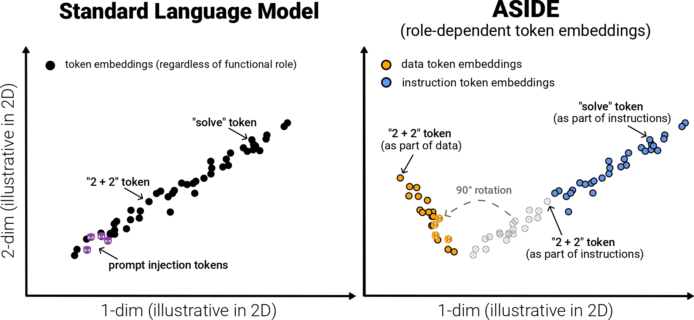

# ASIDE: Architecturally Separated Instruction-Data Embeddings


[](https://arxiv.org/abs/2503.10566)
[](https://www.python.org/downloads/)
[](LICENSE)

<p align="center">
  
</p>


**ASIDE** applies orthogonal rotations to data token embeddings while keeping instruction embeddings unchanged, creating clear separation without additional parameters or special safety training.

## ⚡ Quick Start

### Requirements
- CUDA Toolkit 12.4
- Python 3.12

If your system uses Environment Modules you can satisfy the requirements like this:
```bash
module load python/3.12.8
module load cuda/12.4
```

### Installation
```bash
git clone https://github.com/egozverev/aside.git
cd aside

# Create environment (Python 3.9-3.12), activate it and install dependencies
virtualenv .venv
source .venv/bin/activate  
./install.sh
```

Don't forget to activate modules and the venv every time you run training: 

```bash
module load python/3.12.8
module load cuda/12.4
source .venv/bin/activate  
```

### Training ASIDE
```bash
cd experiments
```
```bash
# Quick start: Train Qwen 2.5 7B with ASIDE
deepspeed --num_gpus=8 fine-tune.py \
--model_family qwen2.5_7b \
--train_version SFTv70 \
--emb_type forward_rot \
--model_ix 0 \
--run_number ASIDE \
--train_type full \
--num_train_epochs 2 \
--per_device_train_batch_size 4 \
--gradient_accumulation_steps 8 \
--learning_rate 2e-5 \
--lr_scheduler_type cosine \
--warmup_ratio 0 \
--logging_steps 10 \
--evaluation_strategy epoch \
--save_strategy epoch \
--eval_steps 1 \
--save_steps 1 \
--save_total_limit 1 \
--load_best_model_at_end True \
--prediction_loss_only True \
--bf16 True \
--embedding_init rot_isoclinic \
--rotation_alpha 1.57079633 \
--learned_rotation False \
--add_linear_shift False \
--rotation_direction right \
--gradual_rotation False

```

### Evaluation

1. **SEP Evaluation** - Instruction-data separation
   ```bash
   cd experiments/evaluations/SEP
   torchrun --nproc_per_node=1 --master_port=29706 get_model_outputs.py forward_rot Qwen2.5-7B 0 SFTv70 forward_rot ASIDE
   ```

2. **AlpacaEval** - General utility
   ```bash
   pip install -U alpaca_eval
   cd experiments/evaluations/AlpacaEval

   torchrun --nproc_per_node=1 --master_port=29712 get_alpaca_outputs.py --data-path ../../data/tatsu-lab/alpaca_farm/eval.json --use-input True --model ../../models/Qwen2.5-7B/forward_rot/train_checkpoints/SFTv70/from_inst_run_ASIDE/last/ --embedding-type forward_rot --batch-size 32

   IS_ALPACA_EVAL_2=False alpaca_eval --model_outputs ../../data/tatsu-lab/alpaca_farm/Qwen2.5-7B_forward_rot_train_checkpoints_SFTv70_from_inst_run_ASIDE_last__l-1_s42.json
   ```

3. **Structured Queries** 
   ```bash
   cd experiments/evaluations/struq
   torchrun --nproc_per_node=1 --master_port=29718 test_on_struq.py --domain all --attack all --model ../../models/Qwen2.5-7B/forward_rot/train_checkpoints/SFTv70/from_inst_run_ASIDE/last/ --embedding_type forward_rot --batch_size 32
   ```

4. **BIPIA**
  (Only subset with programmatic evaluation, i.e., does not require OpenAI models for evaluation)
   ```bash
   cd experiments/evaluations/safety_evals
   python test_safety.py --model_name ../../models/Qwen2.5-7B/forward_rot/train_checkpoints/SFTv70/from_inst_run_ASIDE/last/ --embedding_type forward_rot --base_model Qwen/Qwen2.5-7B --datasets bipia --batch_size 32
   ```

5. **Other safety benchmarks**
   ```bash
   cd experiments/evaluations/safety_evals
   # Run all safety benchmarks (including BIPIA)
   python test_safety.py --model_name ../../models/Qwen2.5-7B/forward_rot/train_checkpoints/SFTv70/from_inst_run_ASIDE/last/ --embedding_type forward_rot --base_model Qwen/Qwen2.5-7B --datasets all --batch_size 32
   
   # Or run specific benchmarks
   python test_safety.py --model_name ../../models/Qwen2.5-7B/forward_rot/train_checkpoints/SFTv70/from_inst_run_ASIDE/last/ --embedding_type forward_rot --base_model Qwen/Qwen2.5-7B --datasets purple gandalf --batch_size 32
   ```


See `experiments/evaluations/README.md` for more details. 


### Interpetability

Please see `experiments/interp/README.md` for a dedicated step-by-step guide on how to reproduce our analysis from the paper (Section 6).


## 🚀 Loading and Using Models

After training, you can load and use ASIDE models for inference. Here's how to set up and run the model. For instance, if the following script is saved as `experiments/example.py`, run `deepspeed --num_gpus=1 experiments/example.py`.

### Basic Usage
```python
import torch
import deepspeed
import json
import os
from huggingface_hub import login

from model_api import CustomModelHandler  # Import your custom handler
from model_api import format_prompt  # Import your prompt formatting function

# Define your instruction and data
instruction_text = "Translate to German."
data_text = "Who is Albert Einstein?"

# Model configuration
hf_token = os.environ["HUGGINGFACE_HUB_TOKEN"]
login(token=hf_token)
embedding_type = "forward_rot"  # or "single_emb", "ise"
base_model =  "Qwen/Qwen2.5-7B" #or "meta-llama/Llama-3.1-8B"  #others
model_path = "path_to_your_model"

# Initialize the model handler
handler = CustomModelHandler(
    model_path, 
    base_model, 
    base_model, 
    model_path, 
    None,
    0, 
    embedding_type=embedding_type, 
    load_from_checkpoint=True
)

# Initialize DeepSpeed inference engine
engine = deepspeed.init_inference(
    model=handler.model,
    mp_size=torch.cuda.device_count(),  # Number of GPUs
    dtype=torch.float16,
    replace_method='auto',
    replace_with_kernel_inject=False
)
handler.model = engine.module

# Load prompt templates
with open("./data/prompt_templates.json", "r") as f:
    templates = json.load(f)

template = templates[0]  
instruction_text = format_prompt(instruction_text, template, "system")
data_text = format_prompt(data_text, template, "user")

# Generate output
output, inp = handler.call_model_api_batch([instruction_text], [data_text])
print(output)
```

## 🔧 Advanced Usage

### Generate Training and evaluation Scripts
```bash
# Create comprehensive hyperparameter sweep scripts
jupyter notebook scripts/generate_train_eval_scripts.ipynb
```
This notebook contains code that generates SLURM scripts for:
- Embedding types: `forward_rot` (ASIDE), `single_emb` (vanilla), `ise` (baseline)
- All supported models
- Different hyperparameters

Additionally, this notebook contain code that generates SLURM scripts for evals. 

### Analysis & Visualization
```bash
# Analyze results
jupyter notebook analysis/analyze_results.ipynb

# Generate paper figures
jupyter notebook analysis/visualization.ipynb
```

## 📁 Repository Structure
```
aside/
├── experiments/
│   ├── configs/           # Model configurations
│   ├── evaluations/       # Benchmarks: SEP, AlpacaEval, BIPIA, etc.
│   ├── interp/           # Interpretability analysis
│   └── fine-tune.py      # Main training script
├── analysis/
│   ├── analyze_results.py # Result processing
│   └── visualization.ipynb # Figure generation
└── scripts/
    └── generate_train_eval_scripts.ipynb
```


## 🛠️ Troubleshooting

- **OOM Errors**: Reduce `per_device_train_batch_size` in config
- **CUDA Issues**: Requires CUDA 12.4

## 📖 Citation

```bibtex

@inproceedings{zverev2025aside,
  author       = {Zverev, Egor and Kortukov, Evgenii and Panfilov, Alexander and Volkova, Alexandra and Tabesh, Soroush and Lapuschkin, Sebastian and Samek, Wojciech and Lampert, Christoph H.},
  title        = {ASIDE: Architectural Separation of Instructions and Data in Language Models},
  booktitle    = {ICLR 2025 Building Trust in LLMs and LLM Applications Workshop},
  year         = {2025},
}
```

## 📄 License

Apache 2.0 License - see [LICENSE](LICENSE) for details.

## 📧 Contact

For questions or issues, please open a [GitHub issue](https://github.com/egozverev/aside/issues) or contact the authors through the paper correspondence.
